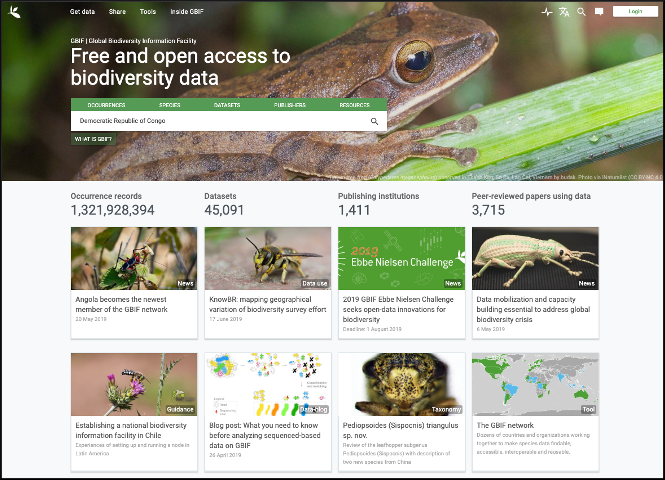
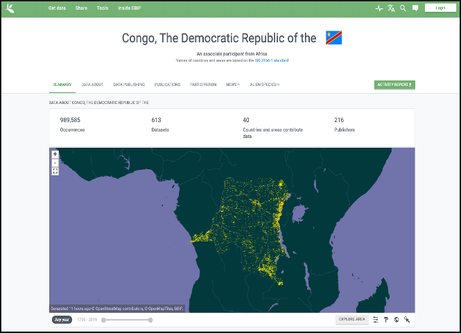
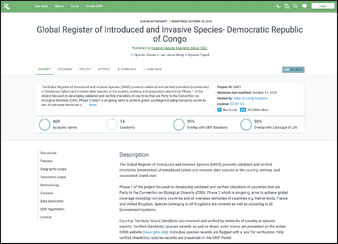

[multipage-level=2]
== About GBIF 

[NOTE.objectives]
The Global Biodiversity Information Facility (GBIF) is an international network of country and organizational Participants that exists to enable free and open access to biodiversity data from all sources and to support biodiversity science, environmental research, and evidence based decision-making. 
GBIF operates as a federated system of distributed data publishing efforts, coordinated through a global informatics infrastructure and collaborative network.
In this module, you will learn more about GBIF.

=== What is GBIF?

[NOTE.presentation]
In this video (03:23) you will learn about GBIF through animation. It is a co-production of SiB Colombia and GBIF Spain, both GBIF national nodes, with co-funding from GBIF Spain and Instituto de Investigación de Recursos Biológicos Alexander von Humboldt (IAvH). If you are unable to watch the embeded Vimeo video, you can link:../videos/GBIF-La-biblioteca-de-la-vida.mp4[download^,opts=download] it locally. (MP4 - 19.3 MB)

video::236573907[vimeo, height=480, width=640, align=center]

=== Introduction to GBIF

[NOTE.presentation]
In this video (07:55), Tim Hirsch, Deputy Director of the GBIF Secretariat, provides you with an overview of GBIF. 
If you are unable to watch the embeded Vimeo video, you can link:../videos/Introduction-to-GBIF.mp4[download^,opts=download] it locally. (MP4 - 32.3 MB)

video::434831655[vimeo, height=480, width=640, align=center]

=== Introduction to GBIF Participant Nodes

[NOTE.presentation]
Since GBIF’s founding in 2001, the participating countries and organizations have been testing and developing models for coordinating the mobilization, management and reuse of biodiversity data at the national level or within an organization’s scope. 
The formation of Participant ‘nodes’ has been central to these efforts. 
Designated by each Participant, these teams coordinate the needs and interests of the many stakeholders involved. 
In this video (07:53), we look at the variety of node models in the GBIF network to present generalized concepts relating to Participant nodes and the roles that they play in the GBIF community.
If you are unable to watch the embeded Vimeo video, you can link:../videos/Role-of-nodes-in-GBIF.mp4[download^,opts=download] it locally. (MP4 - 14.0 MB)

video::543599833[vimeo, height=480, width=640, align=center]

=== Countries/Economies in GBIF

[NOTE.activity]
Investigate how your country/economy is represented in GBIF

.The GBIF website has pages dedicated to countries, including for countries that do not yet participate in GBIF. You can use the search box on the homepage to look up a country/economy name.

.The tabs on these pages provide a general description of the data available about the biodiversity of the country, any data published by national institutions, as well as other relevant information on the use of data by researchers in the country.

.A recent collaboration with the IUCN Invasive Species Specialist Group means that, for many countries, a checklist of introduced and invasive alien species is available from the Global Register of Introduced and Invasive Species (GRIIS).

****
. Look up your country on the GBIF website.
. Does your country participate in GBIF?
. How many institutions are publishing data?
. Is a list of introduced and invasive alien species available for your country?
. How well does the information available on GBIF reflect what you know about the biodiversity of your country?
****

=== Review

[NOTE.quiz]
Quiz yourself on the concepts learned in this section.
****
// Note the lack of empty lines between the end of the question (....) and the start of the next question
// (. What…) is required, so I have added // comments to help separate them.
// The + connects the question into the numbered list item, see https://docs.asciidoctor.org/asciidoc/latest/lists/continuation/

// Question 1
. What is GBIF?
+
[question, mc]
....
- [ ] An intergovernmental network and research infrastructure
- [ ] A collaboration among governments and international organizations
- [ ] A network of participant nodes
- [ ] A secretariat, based in Copenhagen, Denmark
- [x] All of the above
....
// Question 2
. When was GBIF established?
+
[question, mc]
....
- [ ] 1992
- [ ] 1999
- [x] 2001
....
// Question 3
. Which of the following is the best description of a GBIF Participant node?
+
[question, mc]
....
- [ ] A GBIF national office, funded by the GBIF Secretariat
- [x] A team designated by a Participant country or organization to coordinate a network of people and institutions that produce, manage and use biodiversity data, collectively building an infrastructure for delivering biodiversity information
- [ ] A regional hub for expertise in biodiversity data mobilization and data use
- [ ] The informatics infrastructure that connects with GBIF.org to enable a Participant country or organization to publish biodiversity data
....
// Question 4
.  Which of the following is NOT a typical function of a GBIF Participant node?
+
[question, mc]
....
- [ ] Coordinating a community of initiatives relating to biodiversity information, including making connections to the international GBIF network 
- [ ] Promoting and supporting the mobilization of biodiversity data within the country or organization’s scope so that as many sources as possibly are freely and openly available 
- [ ] Encouraging the reuse of the available data to support biodiversity-related science and support decision-making for sustainable development 
- [ ] Providing expertise on biodiversity data management and improving data quality to support users’ needs 
- [x] Maintaining a mirror website of the GBIF.org to ensure real-time backup of the GBIF data index and improve user access from within the country
....
// Question 5
. What is a GBIF Participant?
+
[question, mc]
....
- [ ] The person designated by a participating country/economy/organization to manage the activities of the node to coordinate a biodiversity information facility
- [x]  A country, economy or organization that joins GBIF by signing the Memorandum of Understanding and establishing a co-ordinated effort to support open access and use of biodiversity data, to advance scientific research, and to promote technological and sustainable development
- [ ]  The broader structure of people and institutions, coordinated by the node, that collectively forms an infrastructure for delivering biodiversity information to relevant stakeholders
- [ ]  The person designated by the participating country/economy/organization to act as its representative to the GBIF Governing Board and take part in the global-level decision making
....
// Question 6
. What is a GBIF Head of Delegation?
+
[question, mc]
....
- [ ] The person designated by a participating country/economy/organization to manage the activities of the node to coordinate a biodiversity information facility
- [ ]  A country, economy or organization that joins GBIF by signing the Memorandum of Understanding and establishing a co-ordinated effort to support open access and use of biodiversity data, to advance scientific research, and to promote technological and sustainable development
- [ ]  The broader structure of people and institutions, coordinated by the node, that collectively forms an infrastructure for delivering biodiversity information to relevant stakeholders
- [x] The person designated by the participating country/economy/organization to act as its representative to the GBIF Governing Board and take part in the global-level decision making
....
// Question 7
. What is a Biodiversity information facility?
+
[question, mc]
....
- [ ] The person designated by a participating country/economy/organization to manage the activities of the node to coordinate a biodiversity information facility
- [ ]  A country, economy or organization that joins GBIF by signing the Memorandum of Understanding and establishing a co-ordinated effort to support open access and use of biodiversity data, to advance scientific research, and to promote technological and sustainable development
- [x]  The broader structure of people and institutions, coordinated by the node, that collectively forms an infrastructure for delivering biodiversity information to relevant stakeholders
- [ ]  The person designated by the participating country/economy/organization to act as its representative to the GBIF Governing Board and take part in the global-level decision making
....
// Question 8
. What is a Node manager?
+
[question, mc]
....
- [x] The person designated by a participating country/economy/organization to manage the activities of the node to coordinate a biodiversity information facility
- [ ]  A country, economy or organization that joins GBIF by signing the Memorandum of Understanding and establishing a co-ordinated effort to support open access and use of biodiversity data, to advance scientific research, and to promote technological and sustainable development
- [ ]  The broader structure of people and institutions, coordinated by the node, that collectively forms an infrastructure for delivering biodiversity information to relevant stakeholders
- [ ]  The person designated by the participating country/economy/organization to act as its representative to the GBIF Governing Board and take part in the global-level decision making
....
// Question 9
. Who designates the institution that hosts the GBIF Participant node?
+
[question, mc]
....
- [x] The Head of Delegation
- [ ] The GBIF Secretariat
....
****
