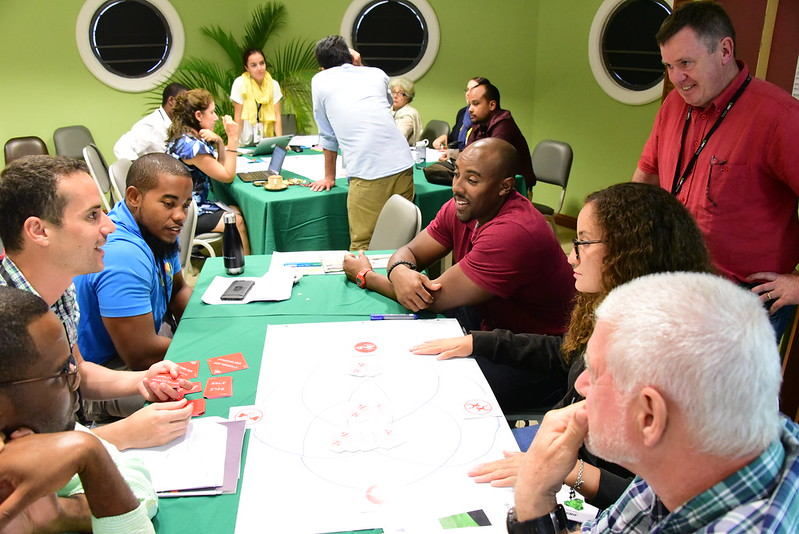

[multipage-level=2]
== Community of practice 
[NOTE.objectives]
In this section, you will learn about GBIF's community of practice, capacity enhancement and funding opportunities and how to stay connected with GBIF.

=== Community of practice

[NOTE.presentation]
In this video (06:44), you will review participation in GBIF, and take a closer look at the four key ways that volunteers contribute to the GBIF community of practice: as mentors, trainers, biodiversity open data ambassadors and translators. 
If you are unable to watch the embeded Vimeo video, you can link:../videos/Community-of-Practice.mp4[download^,opts=download]  it locally. (MP4 - 14.4 MB)

video::460207962[vimeo, height=480, width=640, align=center]

If you are undertaking a biodiversity project and would like to request support from a mentor with data mobilization, management or use, please contact mentors@gbif.org. 

We encourage you to consider whether you can contribute to the GBIF community of practice in any of these roles. We would welcome your participation! 

Further information on how to participate in the community of practice is available on GBIF.org:

* https://www.gbif.org/article/5SExsCfj7UaUkMCsuc6Oec/mentors-and-trainers[Mentors and trainers^]
* https://www.gbif.org/article/6dNF1d0tgcI4cmqeoS2sQ4/biodiversity-open-data-ambassadors[Biodiversity open data ambassadors^]
* https://www.gbif.org/translators[Translators^]

You are also welcome to contact us at info@gbif.org to discuss how you can contribute.

=== Capacity enhancement and funding opportunities

GBIF is a growing global network of Participant countries, economies and organizations, each with different priorities and capacity assets and needs. 
Capacity enhancement is recognized as essential to underpin the sustainable performance of the GBIF Participant network and all its members, independent of their level of development. 

Broadly speaking, much of GBIF’s work contributes to capacity enhancement. 
The Participant nodes ensure capacity development at the national level, often providing training for individuals and institutions within their networks. 
Collaboration between Participants through GBIF’s governance structures enables further international and regional exchange and partnerships. 

:figure-caption!:
.Training participants at the Node Management workshop in Trinidad 2019 by Mélianie Raymond (licensed under https://creativecommons.org/licenses/by/4.0[CC-BY 4.0])

The GBIF Secretariat supports the work of the network, which contributes to capacity development, in particular by coordinating activities, engaging volunteers in the community of practice and supporting the development of core training materials. 
The Secretariat’s role in capacity enhancement activities leans more toward facilitation than implementation: providing guidance, documenting best practices, collating training material, coordinating activities, and creating or aligning opportunities. 
The Secretariat plays a further role in enhancing capacity by providing funding opportunities for collaborative projects in the network, often with a focus on mobilizing biodiversity data, supporting the use of GBIF-mobilized data and strengthening national biodiversity information facilities.

You can find more information about GBIF’s https://www.gbif.org/resource/search?contentType=programme[funding programmes^] on our website.

=== Engaging with GBIF

Please stay in contact with GBIF to keep up with events, opportunities, new features and other news.

Sign up for GBIF’s https://www.gbif.org/newsletters[newsletter and to mailing lists^], follow GBIF on https://twitter.com/gbifnews[Twitter^] or https://www.facebook.com/gbifnews[Facebook^], and keep up to date with https://www.gbif.org/resource/search?contentType=news[news^] on the website.

GBIF organizes regular https://www.gbif.org/webinars[community webinars^] that are open for anyone to join.

=== Review

[NOTE.quiz]
Quiz yourself on the concepts learned in this module.

****

// Note the lack of empty lines between the end of the question (....) and the start of the next question
// (. What…) is required, so I have added // comments to help separate them.
// The + connects the question into the numbered list item, see https://docs.asciidoctor.org/asciidoc/latest/lists/continuation/

// Question 1
. Who does most of the translations of GBIF materials, including the GBIF.org website and training materials?
+
[question, mc]
....
- [ ] A specialist company with experience in working with biodiversity translation
- [x] Volunteer translators from GBIF’s community of practice
....
// Question 2
. How can I get support with a biodiversity data mobilization project?
+
[question, mc]
....
- [ ] Write to info@gbif.org
- [ ] Request a volunteer mentor to provide remote support
- [ ] Undertake the online data mobilization course
- [x] All of the above
....
// Question 3
. What is a biodiversity open data ambassador?
+
[question, mc]
....
- [x] Biodiversity professionals who promote the principles and best practices of open data sharing and use
- [ ] Experts designated by the Heads of Delegation to represent a GBIF Participant country in scientific fora
....
// Question 4
. GBIF’s materials are not available in my language. What should I do?
+
[question, mc]
....
- [ ] Write to info@gbif.org to request the translation
- [ ] Sign up to be a volunteer translator and contribute to the translation myself
- [ ] Share information on how to be a volunteer translator with others to help in the translation effort
- [x] All of the above
....
****
