[multipage-level=2]
== Data publishing

[NOTE.objectives]
In this module, you will learn about data publishing, incentives for publishing data how to become a publisher, review feeback available for publishers and review information about data papers.

=== What is data publishing?

[NOTE.activity]
In this section, you will learn what data publishing is in the GBIF network.

In simpliest terms, data publishing is making your biodiversity dataset(s) publicly accessible and discoverable in a standardized format.

 
Most organizations within the GBIF Network, otherwise known as publishers, make use of an IPT, the https://www.gbif.org/ipt[Integrated Publishing Toolkit^], to publish their data. These publishers may choose to host their own installation of an IPT like the Field Museum, but generally prefer to find a suitable host for their data publishing activities. This might be through an established GBIF Participant Node like GBIF France or through an established thematic group like VertNet. Or, a another option, might be to make use of one of the GBIF-hosted IPTs like the BID, BIFA or regional IPTs.
 
NOTE: If you are part of groups like Symbiota or the Living Atlases Communities, they have other means to assist you with publishing your data to GBIF.

=== Incentives for publishing open-access biodiversity data

[NOTE.activity]
In this section, you will review some incentives for publishing biodiversity data.

An important part of GBIF's mission is to promote a culture in which people recognize the benefits of publishing open-access biodiversity data, for themselves as well as for the broader society.

* By making your data discoverable and accessible through GBIF and similar information infrastructures, you will *contribute to global knowledge about biodiversity*, and thus to the solutions that will promote its conservation and sustainable use.
* Data publishing enables datasets held all over the world to be integrated, revealing *new opportunities for collaboration* among data owners and researchers.
* Publishing data enables individuals and institutions to be properly credited for their work to create and curate biodiversity data, by *giving visibility to publishing institutions* through good metadata authoring. This recognition can be further developed if you author a peer-reviewed data paper, giving scholarly recognition to the publication of biodiversity datasets.
* Collection managers can *trace usage and citations* of digitized data published from their institutions and accessed through GBIF and similar infrastructures.
* Some funding agencies now require researchers receiving public funds to *make data freely accessible* at the end of a project.

=== Data publisher visability and recognition

[NOTE.activity]
In this section, you will review frameworks for citing and tracking digitial data use on GBIF.org

Giving adequate visibility and recognition to data publishers is of paramount importance to GBIF. 
That is why the organisation has put in place the regulatory and technical frameworks needed to make citing and tracking digital data use, easier than ever before.

*The GBIF Memorandum of Understanding*

GBIF is a multilateral initiative established by intergovernmental agreement and based on a non-binding https://www.gbif.org/mou[Memorandum of Understanding^] (MoU). 
The MoU is the official document that countries and international organizations sign in order to join GBIF.

The MoU is very clear stating that GBIF data publishers need to be acknowledged for their contributions:

----
"4. Attribution. +
GBIF seeks to ensure that the publisher/holder of data is acknowledged and requests that such attribution be maintained in any subsequent use of the data."
----

GBIF strives to make all efforts possible to make this statement a reality.

*The GBIF Data User Agreement*

Prior to accessing any data using GBIF, users need to accept a data user agreement which includes very specific requirements on citation of the origin of the data accessed through GBIF. These are some of the requirements listed in the agreement:

----
"In order to make attribution of use for owners of the data possible, the identifier of ownership of data must be retained with every data record shared onward for reuse."
----

“Users must publicly acknowledge, following the scientific convention of citing sources in conjunction with the use of the data, the Data Publishers whose biodiversity data they have used, where appropriate through use of a Digital Object Identifier (DOI) applying to the dataset (s) and/or data downloads.”

Similarly, the agreement is very specific in stating that the conditions stated in the licenses selected by the data published must be respected.

----
"Users must comply with the terms and conditions included in the licence selected by each Data Publisher, and the licensing information included with each data download. If any provision of this Use Agreement conflicts with the terms and conditions within the licences selected by the Data Publisher, licences selected by the Data Publisher shall prevail."
----

*Citation*

GBIF strongly encourages all users to cite data retrieved from the GBIF network. For that purpose it provides recommended citation strings on the dataset, occurrence and download pages in GBIF.org.

This is especially relevant for datasets published using the “CC-BY” and “CC-BY-NC” licenses, which include specific requirements for citing the origin of the data.

Citation and right strings are automatically generated for data publishers for each dataset when using IPT as the publishing mechanism, providing that one of the standard licenses is selected.

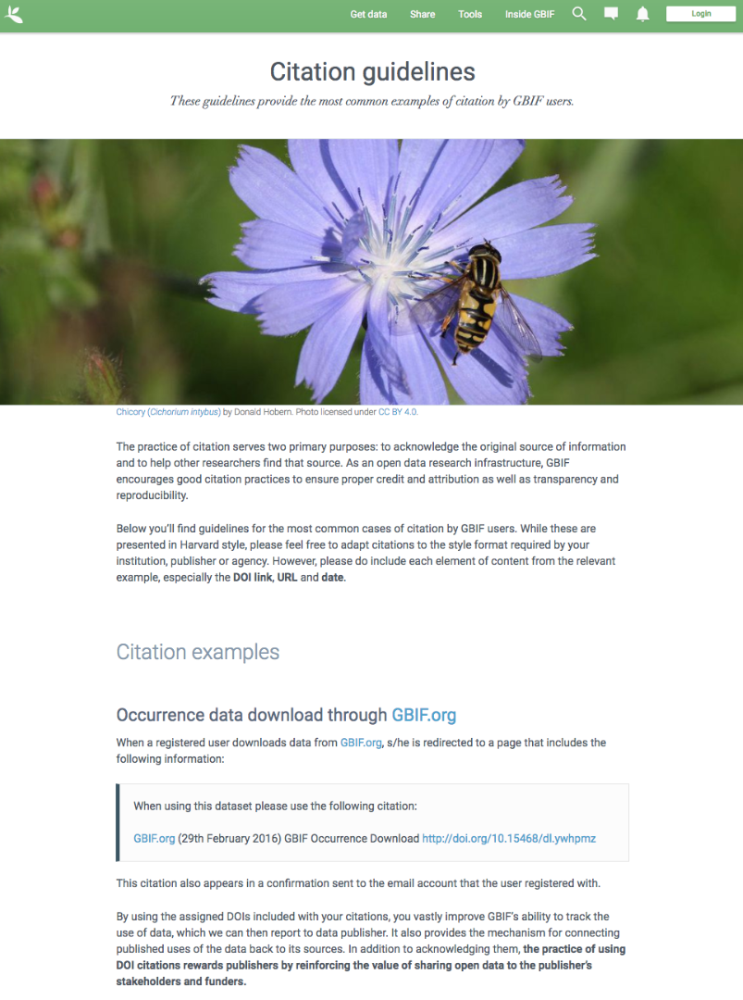

Data publishers must carefully select which license aligns best with any existing requirement from their institutions and from any data access policy to which they may be subject.

*Data publisher page*

All publishers feature their own page on GBIF.org. 
It is important that publishers give some thought to how they want to appear on the website and provide relevant information about their institutions and their teams at the time of registration. 
They should also strive to keep it up to date, as interested parties will use the contact data on that page to contact the team responsible for the data publishing.

*Dataset DOI*

Every time a new version of a dataset is published using an IPT, a DOI (Digital Object Identifier) is assigned. As in the case of the downloads, this identifier allows easy citation and tracking of work derived from the dataset, if the user follows good practices for source citation.

As mentioned before, you can resolve DOI is websites like dx.doi.org: which will always redirect to the original source, in this case, the dataset page. You can also search for DOI using a normal web search, which will normally reveal any other resource citing use of the same DOI such as articles or public reports.

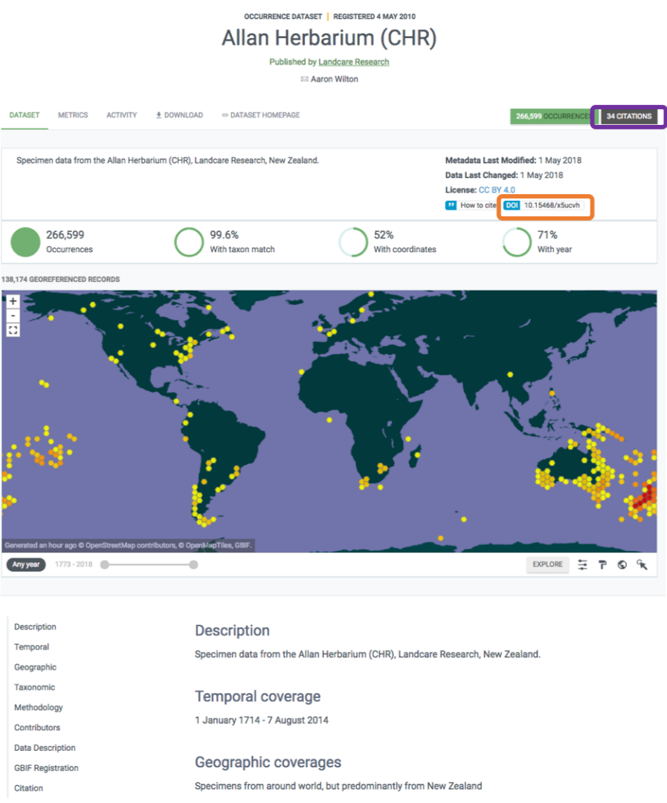

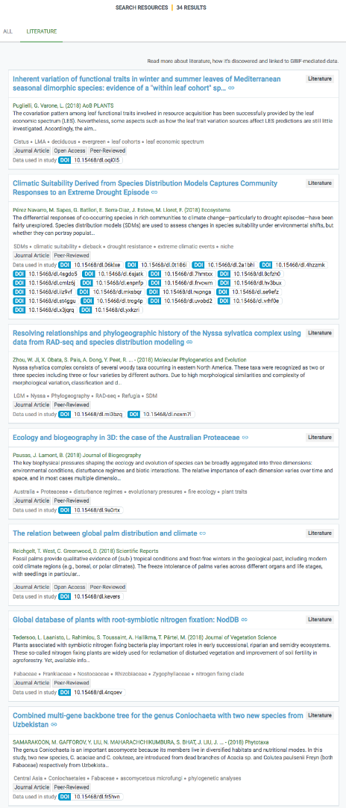

=== How to become a data publisher

[NOTE.activity]
In this section, you will review the steps to become a data publisher.

Organizations wishing to share data through GBIF can register https://www.gbif.org/become-a-publisher[here^] to request endorsement as a data publisher.

:figure-caption!:
.Click on the _How-to menu_ on the GBIF website to navigate to the _Become a publisher_ page
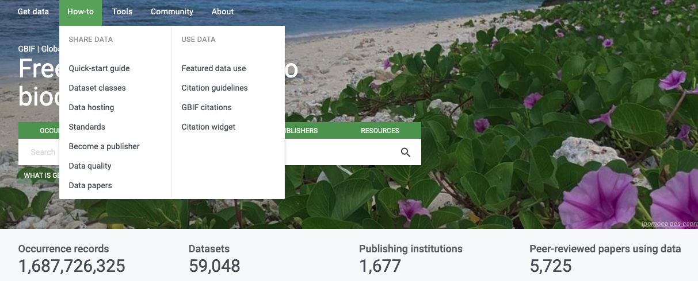

Prospective new publishers are asked to complete an online form. 
The answers provided help GBIF to give proper credit and attribution for the datasets shared by the new publisher.

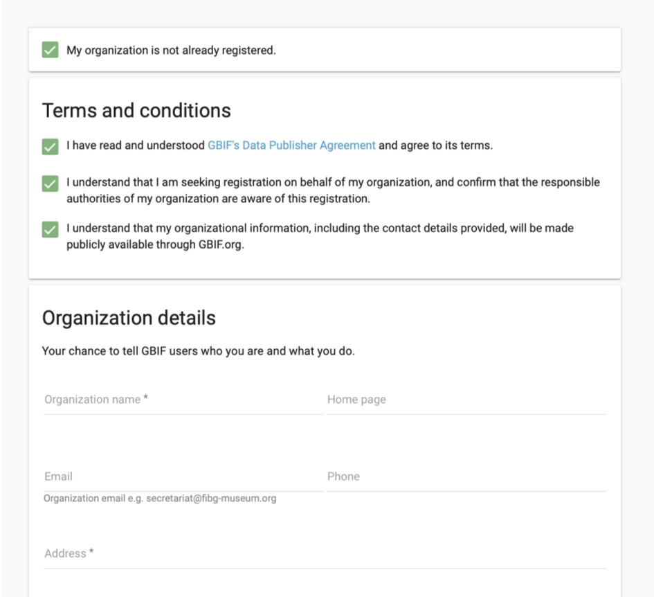

Before GBIF indexes datasets, an institution must receive endorsement as a data publisher from one of the Participant nodes that coordinate activities of the national and organizational Participants in the GBIF network. 
If the country is not yet participating in GBIF, endorsement is sought on the publisher's behalf from within the GBIF community.

The endorsement procedure aims to ensure that:

. Published data are relevant to GBIF’s scope and objectives
. Data hosting arrangements are stable and persistent
. Data publishing and use are supported by strong national, regional and thematic engagement
. Data are as open as possible, and available for sharing and reuse
. Data publishers can respond to feedback and improve data quality

NOTE: At present, GBIF and its Participants only publish data from organizations—that is, institutions, networks and societies—rather than individuals. Individuals wishing to publish data should work through their affiliated organizations to seek endorsement as a publisher.

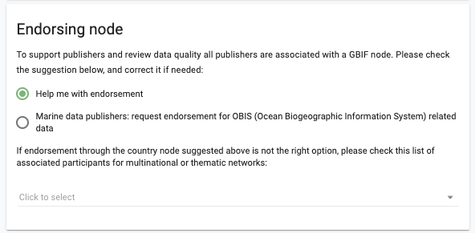

The answers provided will also help users to understand more about the provenance of data shared through the GBIF network.

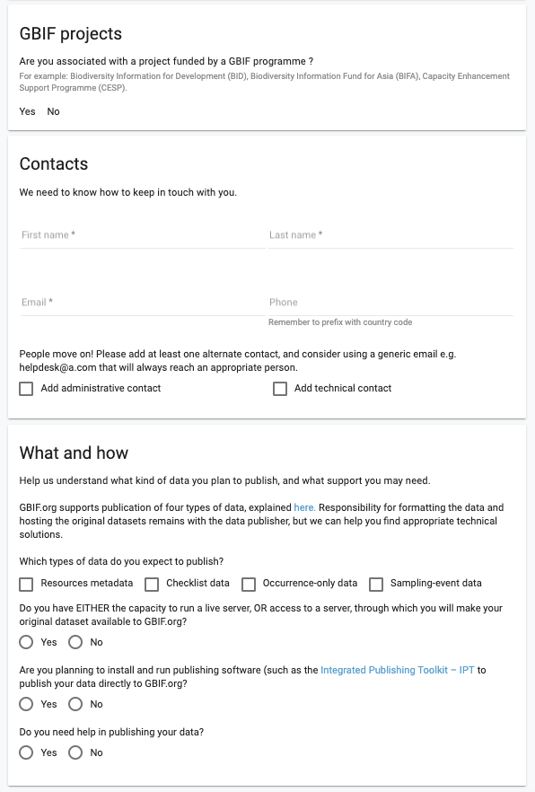

Be sure to search existing publishers before registering a new one to make sure the publisher is not already registered.

NOTE: BID and BIFA projects are required to register at least one data publisher (or provide evidence of an already registered publisher) by specific milestone dates.

=== GBIF data quality requirements

[NOTE.activity]
In this section, you will review GBIF's data quality requirements.

Publishers play an essential role not simply in sharing datasets, but also in managing their quality, completeness and usefulness and ensuring their integration and value within GBIF’s global knowledge base.

:figure-caption!:
.Click on the _How-to menu_ on the GBIF website to navigate to the _Data quality_ page

To share data through GBIF.org, publishers typically have to collate or transform existing datasets into a standardized format. 
This work may include additional processing, content editing and mapping a dataset’s content into one of the available data transfer formats, as well as publication through one of the available data publishing tools, such as GBIF’s free, open-source https://www.gbif.org/ipt[Integrated Publishing Toolkit^] (IPT).

Once published, GBIF’s real-time infrastructure ‘indexes’ or ‘harvests’ new datasets, integrating them into a common access system where users can retrieve any and all data through common search and download services. 
As datasets are indexed, GBIF.org performs additional checks, interpretation and conversion routines to ensure that data are interoperable and comply with minimum standards of data formats, data quality and fitness for use. 
Many criteria for quality and usability of data, however, are best and most easily handled when addressed at their source: the individual dataset.

Publishers thus play an essential role not simply in sharing datasets, but also in managing their quality, completeness and usefulness as well as ensuring their integration and value within GBIF’s global knowledge base. 
Learn more about https://www.gbif.org/data-quality-requirements[data quality requirements^] and recommendations for:

* https://www.gbif.org/data-quality-requirements-occurrences[Occurrence-only datasets^]
* https://www.gbif.org/data-quality-requirements-checklists[Checklists^]
* https://www.gbif.org/data-quality-requirements-sampling-events[Sampling-event datasets^]

In practice, we encourage those responsible for publishing data to get acquainted with the expected data formats and content requirements as early as possible in the process (see also the pre-configured GBIF Excel templates with required and recommended terms for https://github.com/gbif/ipt/wiki/occurrenceData#templates[occurrence-only datasets^], https://github.com/gbif/ipt/wiki/checklistData#templates[checklists^], and https://github.com/gbif/ipt/wiki/samplingEventData#templates[sampling-event datasets^], all available with example data). 
Doing so will save a lot of effort that may be needed at later stages, for example, in adding data conversions, capturing information for required or strongly recommended fields, or performing and addressing final pre-publication data-quality checks.

NOTE: BID and BIFA projects are required to include their projectID on published datasets as part of the dataset metadata. This allows datasets to be linked to project pages.

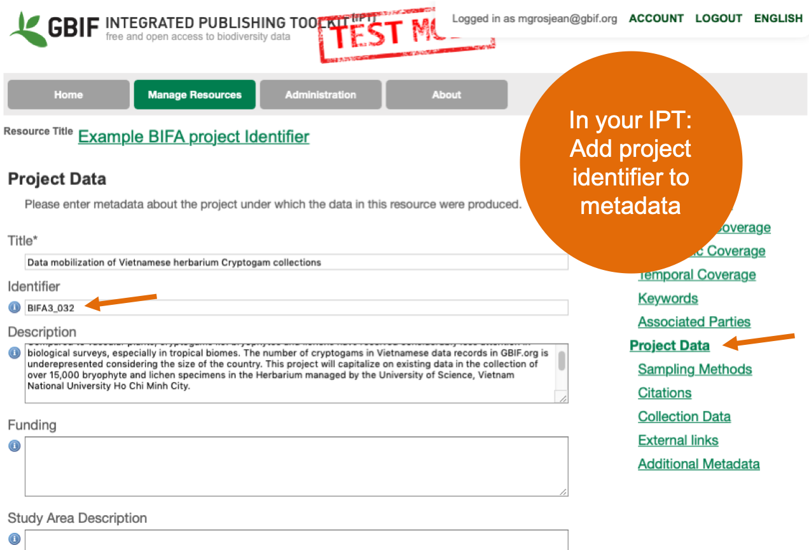

=== Improve published data quality

[NOTE.activity]
In this section, you will learn how to use the GBIF data validator.

The GBIF https://www.gbif.org/tools/data-validator[data validator^] is a service that allows anyone with a GBIF-relevant dataset to receive a report on the syntactical correctness and the validity of the content contained within the dataset. 
By submitting a dataset to the validator, you can go through the validation and interpretation procedures usually associated with publishing in GBIF and quickly determine potential issues in data - without having to publish it.

:figure-caption!:
.Click on the _Tools_ menu on the GBIF website to navigate to the _Data validator_ page
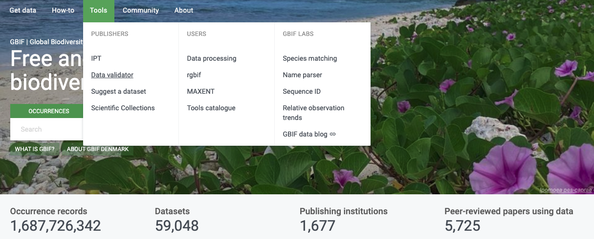

*How does it work?*

You start by uploading the dataset file to the validator, either by 1) clicking SELECT FILE and selecting it on your local computer or 2) dragging the file from a local folder and dropping it on the Drop here icon. 
You can also enter the URL of a dataset file accessible from the internet. 
This is particularly useful for larger datasets. Once you hit the Submit button, the validator starts processing your dataset file. 
You will be taken straight to a page showing the status of the validation.

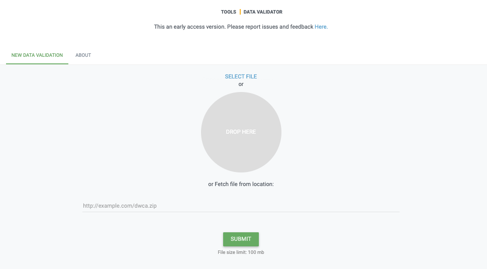

Depending on the size of your dataset, processing might take a while. 
You don’t have to keep the browser window open, as a unique job ID is issued every time a new validation process is started. 
If your dataset is taking too long to process, just save the ID (bookmark the URL) and use it to return at a later time to view the report. 
We’ll keep the report for a month, during which you can come back whenever you like.

*Which file types are accepted?*

* ZIP-compressed Darwin Core Archives (DwC-A) (containing cores Occurrence, Taxon, or Event)
* Integrated Processing Toolkit (IPT) Excel templates containing Checklist, Occurrence, or Sampling-event data
* Simple CSV files containing Darwin Core terms in the first row

*What information is provided from the validation report?*

Once processing is done, you will be able to see the validation report containing the following information:

* a summary of the dataset type and a simple indicator of whether it can be indexed by GBIF or not
* a summary of issues found during the GBIF interpretation of the dataset
* detailed break-down of issues found in metadata, dataset core, and extensions (if any), respectively
* number of records successfully interpreted
* frequency of terms used in dataset

You will also be able to view the metadata as a draft version of the dataset page as it would appear when the dataset it published and registered with GBIF.

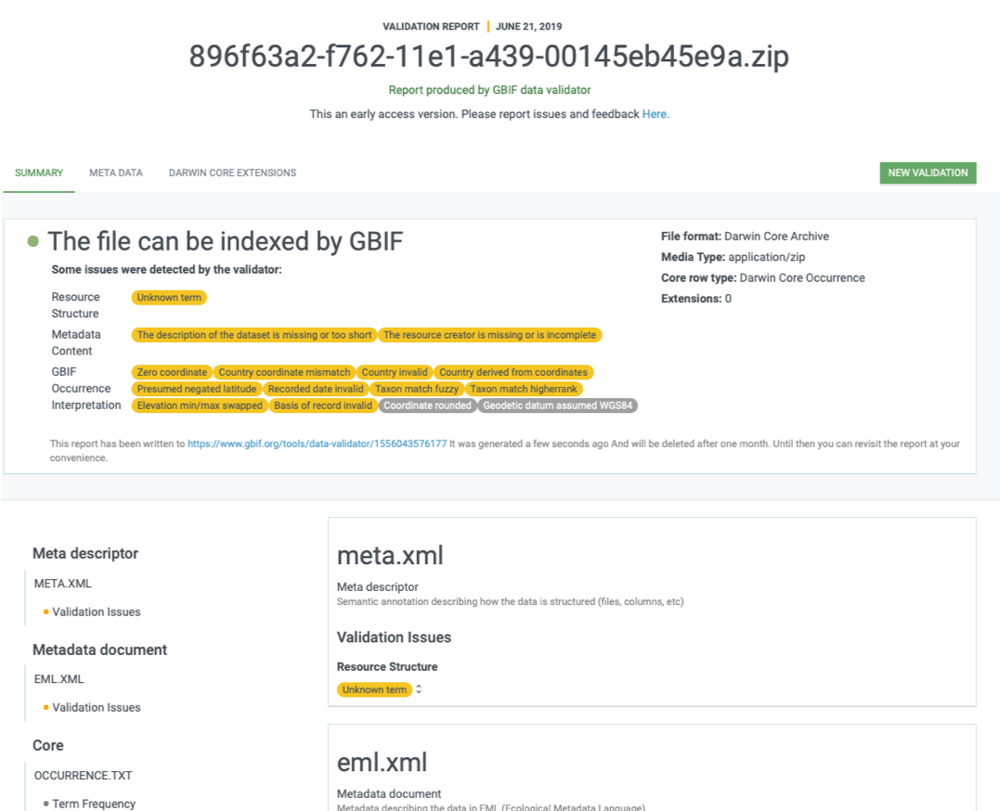

*I’ve got the validation report - now what?*

If the validator finds that your dataset cannot be indexed by GBIF, you should address the issues raised by the validation report before you consider publishing it to GBIF. 
On the other hand, if you get the green light and your dataset is indexable by GBIF, you should still carefully review any issues that may be the result of e.g. conversion errors, etc. which could affect the quality of the data. 
If you find and correct any error - from a single typo to large systematic problems - feel free to resubmit your dataset as many times you like.
