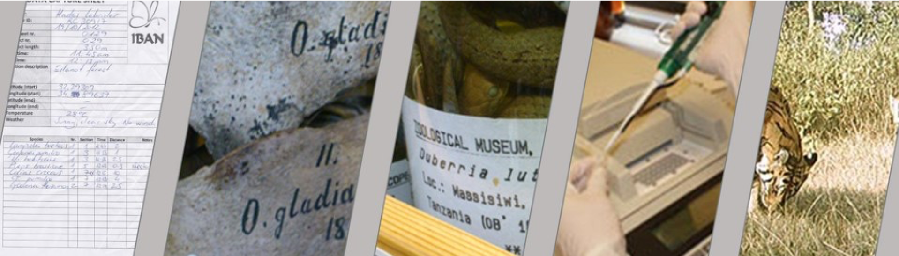
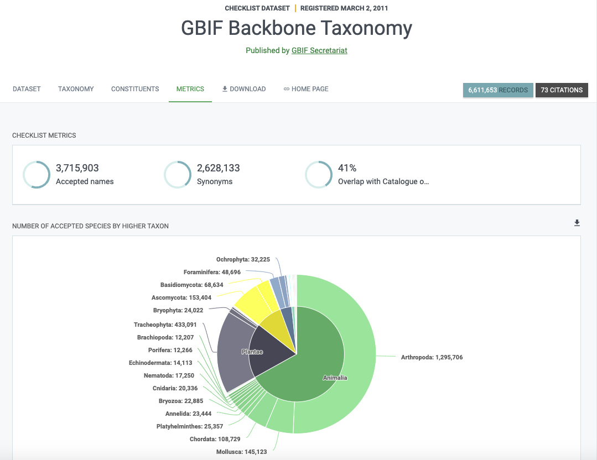
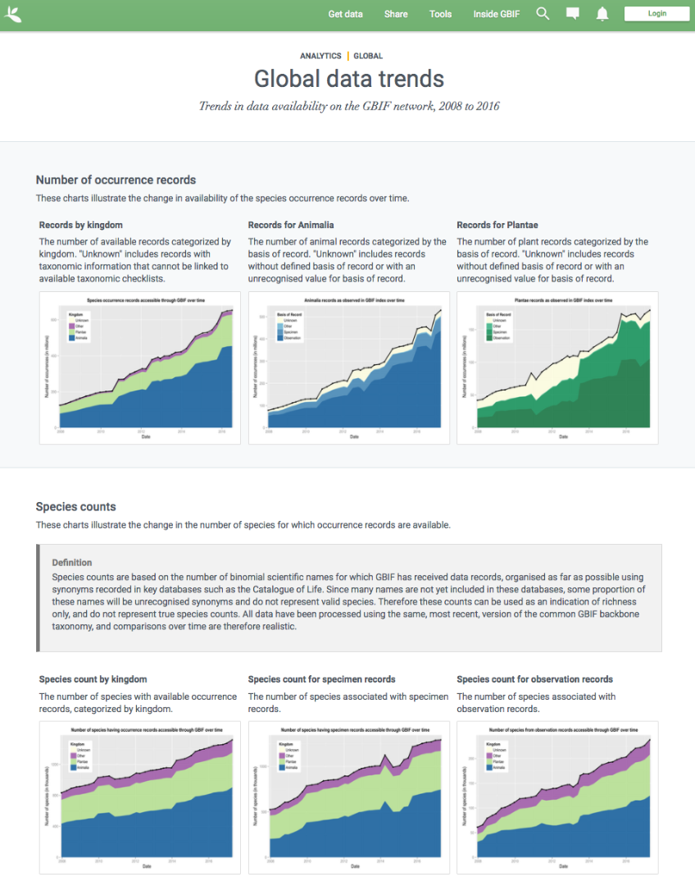
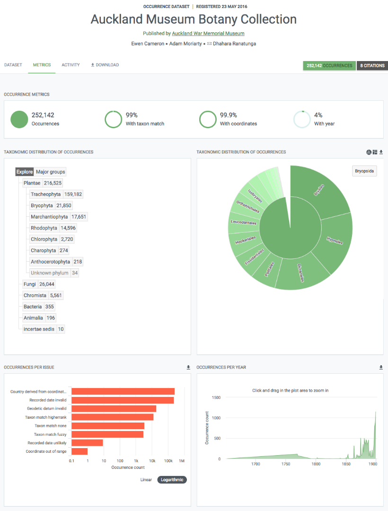
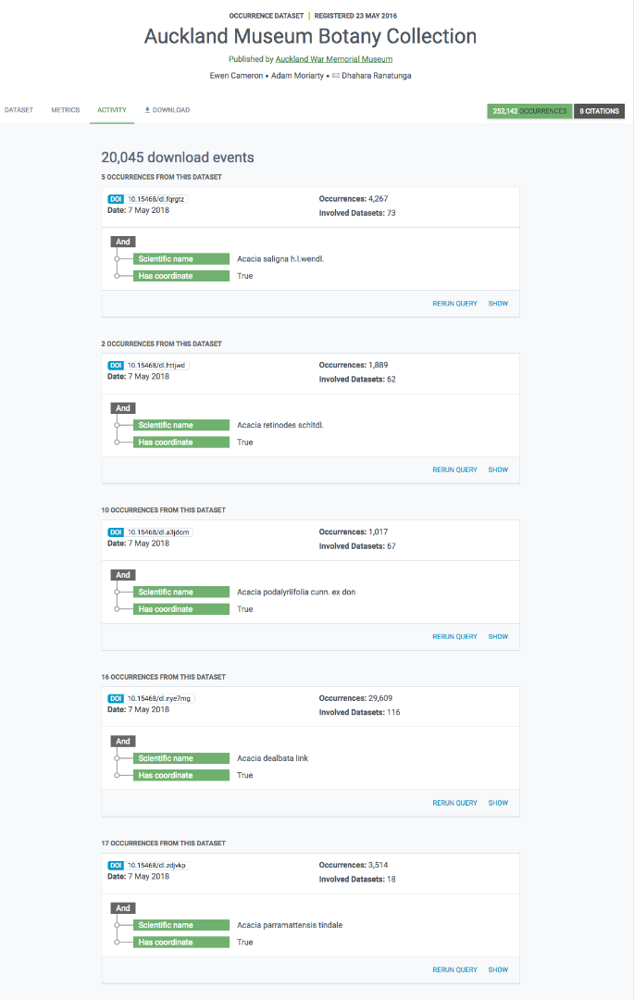

[multipage-level=2]
== GBIF-mediated data 

[NOTE.objectives]
In this module, you will learn about primary biodiversity data and the principles that GBIF follows with regards to data. You will also have a chance to review the various metrics that are available for the data within the portal.

=== Primary biodiversity data

[NOTE.activity]
In this section, you will learn how GBIF makes primary biodiversity data accessible, the accepted dataset types and how GBIF uses the taxonomic backbone to provide taxonmic information.

When we refer to primary biodiversity data, we mean the data that document where and when species have been recorded. 
This knowledge derives from many sources, including everything from museum specimens collected in the 18th and 19th century to geotagged smartphone photos shared by amateur naturalists in recent days and weeks.

The GBIF network draws all these sources together through the use of data standards, such as Darwin Core, which forms the basis for the bulk of GBIF.org's index of hundreds of millions of species occurrence records. 
Publishers provide open access to their datasets using machine-readable Creative Commons licence designations, allowing scientists, researchers and others to apply the data in hundreds of peer-reviewed publications and policy papers each year. 
Many of these analyses—which cover topics from the impacts of climate change and the spread of invasive and alien pests to priorities for conservation and protected areas, food security and human health— would not be possible without this.

==== GBIF dataset classes

We encourage data holders to publish the richest data possible to ensure their use across a wider range of research approaches and questions, but not every dataset includes information at the same level of detail. 
Sharing what is available through GBIF.org is valuable, because even partial information answers some important questions.

The four classes of datasets supported by GBIF start simply and become progressively richer, more structured and more complex.

* Meta-data only - datasets describing *undigitized* resources like those in natural history and other collections
* Checklist - a *catalogue* or list of named organisms, or taxa
* Occurrence - the evidence of the *occurrence of a species* (or other taxon) at a particular place on a specified date. 
Occurrence datasets make up the core of data published through GBIF.org
* Sampling-event - offering evidence that a species occurred at a given location and date, but also making it possible to *assess community composition* for broader taxonomic groups or even the *abundance of species* at multiple times and places.

More information on https://www.gbif.org/dataset-classes[dataset classes^] can be found on the GBIF website.

You might also want to explore https://data-blog.gbif.org/post/choose-dataset-type/[how to choose a dataset type^].

==== GBIF taxonomic backbone

*What is the GBIF Backbone taxonomy?*

The Backbone taxonomy is actually a https://www.gbif.org/dataset/d7dddbf4-2cf0-4f39-9b2a-bb099caae36c[GBIF dataset^].
But not just any dataset, it is probably the most important dataset for GBIF. On its page, it is defined as:

----
a single synthetic management classification with the goal of covering all names GBIF is dealing with
----

*Why does GBIF need a backbone?* 

The backbone is needed to organize the data available on GBIF. 
Without it, we wouldn’t be able to do any taxonomic search and it would be difficult to generate consistent statistics and maps.

As you can imagine, not everyone uses the same classifications or names. 
This results in considerable variations in higher taxa and a large number of synonyms. 
The backbone aims to bring all these names together and organize them.

*How is the backbone generated?*

The backbone is built from other checklists. These include:

* 55 authority checklists,
* a checklist generated from the type specimens shared on GBIF,
* two large sources for stable Operational Taxonomic Units (OTUs): iBOL Barcode Index Numbers and the UNITE Species Hypothesis identifiers,
* and any checklist shared by PLAZI.org on GBIF (currently 27,054 but not all these were available when the backbone was generated).

These checklists are ordered by priority starting with the Catalogue of Life for most taxa. 
This order is crucial as it shapes the taxonomy.

NOTE: Note that many sequence-based occurrences have no Latin names but are named using species hypotheses (UNITE: fungi) or Barcode Index Numbers (iBOL: primarly animals). This is why adding these two major sources of stable OTUs to the latest backbone taxonomy significantly improves GBIF’s indexing functionality for sequence-based biodiversity data.

====
The information above is an excerpt from a 2019 blog post by Marie Grosjean. Read the https://data-blog.gbif.org/post/gbif-backbone-taxonomy/[blog post^] for more detail on the backbone.
====

=== Principles of GBIF-mediated data

[NOTE.activity]
In this section, you will learn about the principles that GBIF follows with regards to data and how data in the GBIF portal are FAIR.

==== Digital object identifiers

A Digital Object Identifier, or DOI, is a http://www.iso.org/iso/catalogue_detail?csnumber=43506[standard^], permanent identifier that provides an actionable, interoperable, persistent link to any entity. 
The concept is that DOI differs from commonly used references like URL web links because it identifies an object itself as a first-class entity, not simply the place where the object is currently located.

In the context of GBIF.org, DOIs serve as stable identifiers for four different types of things: 

. datasets from the GBIF network
. data downloads from GBIF.org
. research articles and reports published by scientific journals, agencies and NGOs
. materials deposited in a general-use repository

GBIF assigns DOIs to all datasets and occurrence downloads. 
When data is used, following DOI https://www.gbif.org/citation-guidelines[citation practice^] ensures an easy and consistent way of crediting dataset holders while also allowing for reproducibility. 
The DOIs will always resolve to dataset or download pages, even if the underlying data is no longer available.

GBIF started issuing DOIs on 3 February 2015. 
Downloads requested before this date do not have DOIs, however, if you wish to cite older downloads, you can contact helpdesk@gbif.org and we will assign DOIs as appropriate.

==== Standards

The data available through GBIF.org and its associated services is the result of the GBIF network of Participants and publishers applying shared rules and conventions to describe, record and structure thousands of different datasets drawn from hundreds of institutions around the world. Common standards are the main enabler for bringing together the hundreds of millions of primary biodiversity records in the GBIF index.

Within the biodiversity domain, the group most often responsible for developing and maintaining data standards is http://www.tdwg.org/[Biodiversity Information Standards^]. This nonprofit scientific and educational association focuses on the development of standards for the exchange of biological and biodiversity data. Members of the biodiversity community generally refer to this group as TDWG (pronounced tad-wig)—a vestigial reminder of its earlier manifestation as the Taxonomic Databases Working Group.

Commonly use standards include:

* Darwin Core: The https://dwc.tdwg.org/[Darwin Core Standard^] (DwC) offers a stable, straightforward and flexible framework for compiling biodiversity data from varied and variable sources. 
The majority of the datasets shared through GBIF.org are published using the Darwin Core Archive format (DwC-A).
* Ecological Metadata Language (EML): https://eml.ecoinformatics.org/[Ecological Metadata Language^] is a metadata standard that records information about ecological datasets in a series of modular and extensible XML document types. 
All of the descriptions of datasets in GBIF.org rely on ‘metadata’—that is, the information about data—using the open-source EML standard, which is administered and maintained by https://knb.ecoinformatics.org/[The Knowledge Network for Biocomplexity^].
Each Darwin Core Archive includes as one of its components an EML file (written in XML format).
* BioCASe/ABCD: The http://www.biocase.org/[Biological Collection Access Service^], commonly referred to as BioCASe, is an international network linking biological collections data from natural history museums, botanical/zoological gardens and research institutions. The http://www.biocase.org/products/protocols[BioCASe protocol^] relies on the http://www.tdwg.org/standards/115[Access to Biological Collections Data^] (ABCD) data exchange standard, which TDWG also administers.

==== Open data

In keeping with a 2014 https://www.gbif.org/news/82363/new-approaches-to-data-licensing-and-endorsement[decision by the GBIF governing board^], data publishers must assign one of the three Creative Commons options to any occurrence dataset. The Governing Board recognized the need for much greater clarity both for data publishers and users on how data may be used when shared via GBIF.org. https://creativecommons.org/[Creative Commons] is a nonprofit organization that helps overcome legal obstacles to the sharing of knowledge and creativity to address the world’s pressing challenges.

* http://creativecommons.org/publicdomain/zero/1.0[CC0^] - no conditions for use
* https://creativecommons.org/licenses/by/4.0/[CC-BY^] - use with attribution
* http://creativecommons.org/licenses/by-nc/4.0/[CC-BY-NC^] - non-commerical use with attribution 

IMPORTANT: Note that the CC-BY-NC licence has a significant effect on the reusability of data. GBIF encourages data publishers to choose the most open option they can wherever possible. It is important to note that images are not subject to the same licence that is applied to the dataset and may have more restricted terms of use. Lastly, attribution/citation is a community norm, so even if the publishers has waived conditions for use, attribution is expected.

==== FAIR data

Many articles from 2011-2016 documented a crisis in scientific reproducability (see below). 
In 2016, the https://www.nature.com/articles/sdata201618[FAIR Guiding Principles for scientific data management and stewardship^] were published in https://www.nature.com/sdata/[Scientific Data^]. 
The principles were designed to improve the *F*indability, *A*ccessibility, the *I*nteroperability and the *R*eusability of datasets and address "an urgent need to improve the infrastructure supporting the reuse of scholarly data." 
Implementation of these principles began in 2018. 
You can read more about http://www.go-fair.org/how-to-go-fair/[How to GO FAIR^] on https://www.go-fair.org/[GO-FAIR.org^].

image::img/web/gofairlogo.svg[align="center", width="208", height="58"]

image::img/web/FairPrinciples2.png[align="center", width="340", height="517"]

*Data found on GBIF.org are FAIR.*

****
*FINDABLE*

GBIF has https://www.gbif.org/data-quality-requirements[requirements] for metadata and datasets. All datasets are identified by https://www.gbif.org/faq?question=how-and-when-does-gbif-assign-digital-object-identifiers-dois[Digital Object Identifiers^] (DOIs).
****

****
*ACCESSIBLE*

The https://www.gbif.org/developer/summary[GBIF Portal API^] provides a machine readable interface (REST + JSON) and use the https://www.gbif.org/ipt[Integrated Publishing Toolkit^] (IPT) as trusted data repository.
****

****
*INTEROPERABLE*

GBIF recommends using the https://eml.ecoinformatics.org/[Ecological Metadata Language^] (EML) for datasets and https://dwc.tdwg.org/[Darwin Core^] for occurrence data.
****

****
*REUSABLE*

GBIF require creative common data licenses (https://creativecommons.org/publicdomain/zero/1.0[CC0^], https://creativecommons.org/licenses/by/4.0[CC BY^], or https://creativecommons.org/licenses/by-nc/4.0[CC BY-NC^]). Provenance available from the GBIF portal.
****

====
*Literature references*

Baker (2016) 1,500 scientists lift the lid on reproducibility. Nature 533: 452-454 (26 May 2016) doi:10.1038/533452a

Baker (2016) Reproducibility: Seek out stronger science. Nature 537: 703-704 (29 September 2016) doi:10.1038/nj7622-703a

Nature editorial (2016) Reality check on reproducibility. Nature 533: 437 (26 May 2016) doi:10.1038/533437a

Baker (2016) Statisticians issue warning over misuse of P values. Nature 531: 151 (10 March 2016) doi:10.1038/nature.2016.19503

Nosek et al. (2015) Promoting an open research culture. Science 348(6242): 1422-1425. DOI:10.1126/science.aab2374

Leek and Peng (2015) Statistics: P values are just the tip of the iceberg. Nature 520: 612 (30 April 2015) doi:10.1038/520612°

Nuzzo (2015) How scientists fool themselves – and how they can stop. Nature 526: 182–185 (08 October 2015) doi:10.1038/526182a

Hayden (2013) Weak statistical standards implicated in scientific irreproducibility. Nature doi:10.1038/nature.2013.14131

Young (2012) Replication studies: Bad copy. Nature 485, 298–300 (17 May 2012) doi:10.1038/485298a

Callaway (2011) Reports finds massive fraud at Dutch universities. Nature 479, 15 (1 November 2011) doi:10.1038/479015a
====

=== Data metrics

[NOTE.activity]
In this section review the various metrics available for datasets.

One of the many benefits of publishing data via GBIF is that, during the indexing process, GBIF analyses all datasets and produces https://www.gbif.org/analytics/global[metrics^] about them. These metrics are made available in several different ways:

* global trends
* country pages
* dataset content statistics
* dataset download activity

Participants and publishers can use this information to improve the quality of their datasets, e.g. by addressing issues detected during the indexing process. They can also use the access statistics as evidence of real user interest in their datasets and potential use of the published data.
Global data trends

GBIF.org regularly updates analytics to provide an overview of global trends in the data from 2008 to the present. The charts illustrate trends in:

* occurrence records
* species counts
* time and seasonality
* completeness and precision
* geographic coverage for recorded species
* data sharing with country of origin

*Dataset content statistics*

Each dataset page includes a tab labeled ‘Metrics’. This tab gives access to graphs and tables resulting from the analysis of the contents of the dataset. This includes a summaries of:

* Taxonomic distribution (both list and chart)
* Occurrences per issue
* Occurrences per year

The charts/tables are interactive and you can click to filter and explore further. Additionally, the images can be downloaded for reporting purposes.

*Data access logs*

There is a third tab in occurrence dataset pages labeled ‘Activity’. In this tab you can see a list of all download requests that included records from that dataset, including their download DOI for easy tracking.

=== Review

[NOTE.quiz]
Quiz yourself on the concepts learned in this module.

****

// Note the lack of empty lines between the end of the question (....) and the start of the next question
// (. What…) is required, so I have added // comments to help separate them.
// The + connects the question into the numbered list item, see https://docs.asciidoctor.org/asciidoc/latest/lists/continuation/

// Question 1
. What dataset class makes up the core of data published within GBIF?
+
[question, mc]
....
- [ ] Metadata-only
- [ ] Checklist
- [x] Occurrence
- [ ] Sampling-event
....
// Question 2
. What is the taxonomic backbone?
+
[question, mc]
....
- [ ] A dataset
- [ ] A management classification with the goal of covering all names in GBIF
- [ ] Allows for taxonomic search on GBIF
- [x] All of the above
....
// Question 3
. Which licenses or waivers can be applied to datasets published in GBIF?
+
[question, mc]
....
- [x] CC BY
- [ ] CC BY-SA
- [x] CC BY-NC
- [ ] CC BY-NC-SA
- [ ] CC BY-ND
- [ ] CC BY-NC-ND
- [ ] CC BY-NC-SA
- [x] CC0
....
// Question 4
. Images are subject to the same licenses as datasets?
+
[question, mc]
....
- [ ] True
- [x] False
....
// Question 5
. GBIF data are FAIR?
+
[question, mc]
....
- [x] True
- [ ] False
....
****
