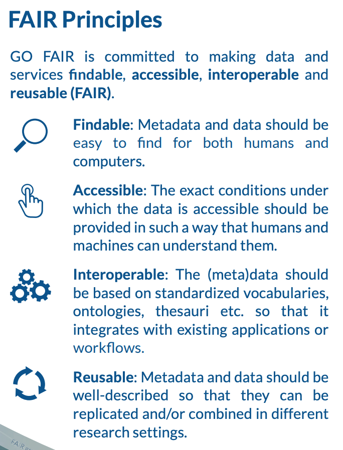

[multipage-level=2]
== GBIF-mediated data 

[NOTE.objectives]
In this module, you will learn about primary biodiversity data, dataset types accepted by GBIF, principles of GBIF-mediated data, and the GBIF Taxonomy Backbone. 

=== Primary biodiversity data

==== Biodiversity dataset types

==== GBIF Backbone Taxonomy

=== Principles of GBIF-mediated data

==== Digital object identifiers (DOI)

==== Standards - why important to our work

==== Open data (licenses) (images, text)

==== FAIR data

image::img/web/gofairlogo.svg[align="center", width="208", height="58"]

Many articles from 2011-2016 documented a crisis in scientific reproducability (see below). 
In 2016, the www.nature.com/articles/sdata201618[FAIR Guiding Principles for scientific data management and stewardship^] were published in www.nature.com/sdata/[Scientific Data^]. 
The principles were designed to improve the *F*indability, *A*ccessibility, the *I*nteroperability and the *R*eusability of datasets and address "an urgent need to improve the infrastructure supporting the reuse of scholarly data." 
Implementation of these principles began in 2018. 
You can read more about www.go-fair.org/how-to-go-fair/[How to GO FAIR^] on www.go-fair.org/[GO-FAIR.org^].

Data found on GBIF.org are FAIR.

****
*FINDABLE*

GBIF has https://www.gbif.org/data-quality-requirements[requirements] for metadata and datasets. All datasets are identified by https://www.gbif.org/faq?question=how-and-when-does-gbif-assign-digital-object-identifiers-dois[Digital Object Identifiers^] (DOIs).
****

****
*ACCESSIBLE*

The https://www.gbif.org/developer/summary[GBIF Portal API^] provides a machine readable interface (REST + JSON) and use the https://www.gbif.org/ipt[Integrated Publishing Toolkit^] (IPT) as trusted data repository.
****

****
*INTEROPERABLE*

GBIF recommends using the https://eml.ecoinformatics.org/[Ecological Metadata Language^] (EML) for datasets and https://dwc.tdwg.org/[Darwin Core^] for occurrence data.
****

****
*REUSABLE*

GBIF require creative common data licenses (https://creativecommons.org/publicdomain/zero/1.0[CC0^], https://creativecommons.org/licenses/by/4.0[CC BY^], or https://creativecommons.org/licenses/by-nc/4.0[CC BY-NC^]). Provenance available from the GBIF portal.
****

====
*Literature references*

Baker (2016) 1,500 scientists lift the lid on reproducibility. Nature 533: 452-454 (26 May 2016) doi:10.1038/533452a

Baker (2016) Reproducibility: Seek out stronger science. Nature 537: 703-704 (29 September 2016) doi:10.1038/nj7622-703a

Nature editorial (2016) Reality check on reproducibility. Nature 533: 437 (26 May 2016) doi:10.1038/533437a

Baker (2016) Statisticians issue warning over misuse of P values. Nature 531: 151 (10 March 2016) doi:10.1038/nature.2016.19503

Nosek et al. (2015) Promoting an open research culture. Science 348(6242): 1422-1425. DOI:10.1126/science.aab2374

Leek and Peng (2015) Statistics: P values are just the tip of the iceberg. Nature 520: 612 (30 April 2015) doi:10.1038/520612°

Nuzzo (2015) How scientists fool themselves – and how they can stop. Nature 526: 182–185 (08 October 2015) doi:10.1038/526182a

Hayden (2013) Weak statistical standards implicated in scientific irreproducibility. Nature doi:10.1038/nature.2013.14131

Young (2012) Replication studies: Bad copy. Nature 485, 298–300 (17 May 2012) doi:10.1038/485298a

Callaway (2011) Reports finds massive fraud at Dutch universities. Nature 479, 15 (1 November 2011) doi:10.1038/479015a
====

=== Review

